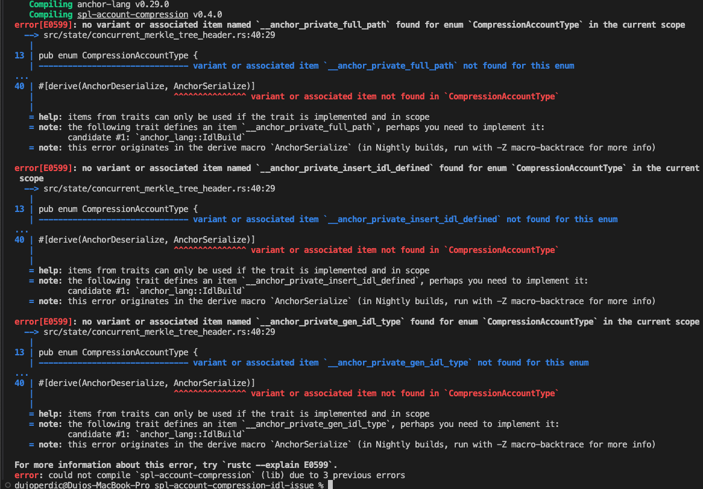

# spl-account-compression idl issue

This is a simple anchor program with a function to initialize a merkle tree with a CPI using spl-account-compression crate.

Steps to reproduce the error:

1. Run `avm use 0.29.0` to ensure there is no version mismatch between the project anchor version and cli anchor version
2. Run `anchor build`

The code will refuse to compile and throw the following errors:



One thing to note is that adding the following line in `spl-account-compression-0.4.0/src/state/concurrent_merkle_tree_header.rs` allows the program to compile.

```rs
impl anchor_lang::IdlBuild for CompressionAccountType {}
```
